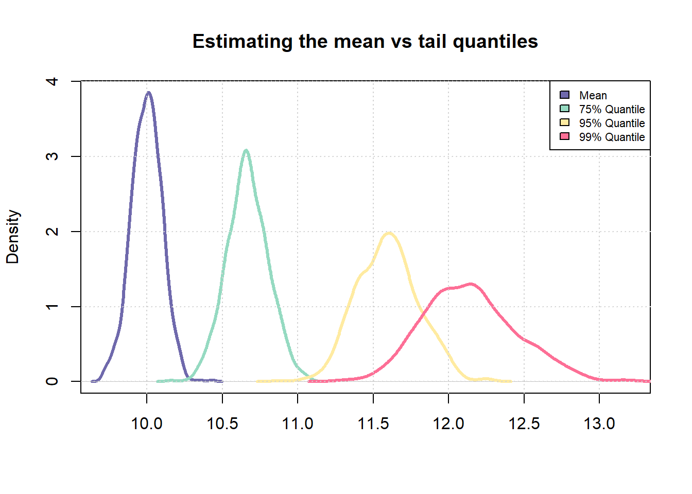
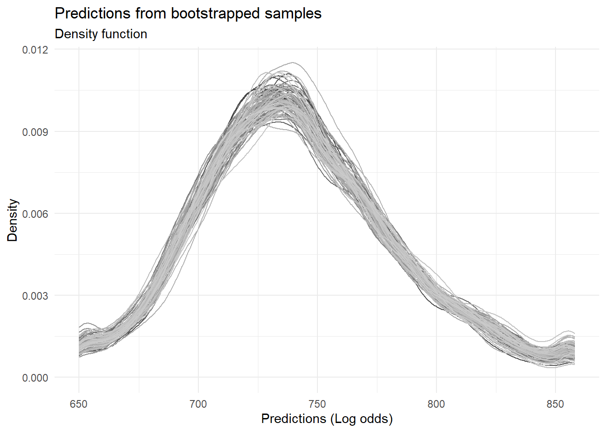
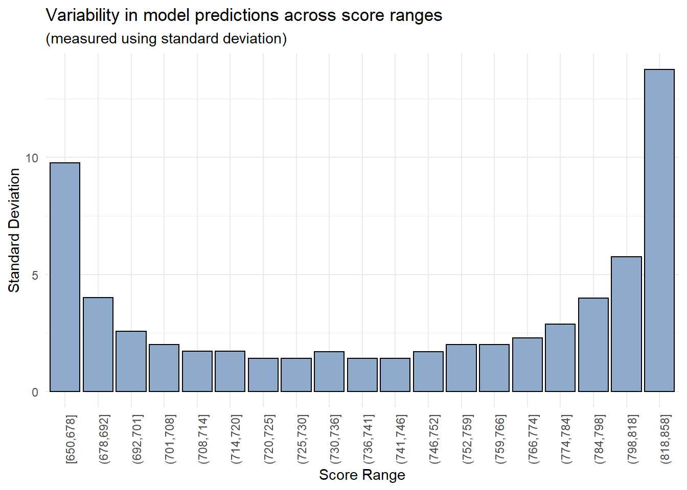

When building risk scorecards, apart from the variety of performance metrics, analysts also assess something known as  `risk-ranking` i.e. whether or not the observed event rates increase (or decrease) monotonically with increasing (or decreasing) scores. Sometimes, models are not able to risk-rank borrowers in the tails (regions of very high or very low scores). While this is expected, it would be nice if we could quantify this effect and one way to do this would be to use bootstrapped samples to assess variability in model predictions. 

## Basic idea
The underlying idea is very simple - less available data for estimation equates to lower quality of estimation. As a simple example, we can observe this effect when trying to estimate quantiles of a probability distribution. 


```r
# Number of samples to be drawn from a probability distribution
n_samples <- 1000

# Number of times, sampling should be repeated
repeats <- 100

# Mean and std-dev for a standard normal distribution
mu <- 5
std_dev <- 2

# Sample
samples <- rnorm(n_samples * repeats, mean = 10)

# Fit into a matrix like object with `n_samples' number of rows 
# and `repeats` number of columns
samples <- matrix(samples, nrow = n_samples, ncol = repeats)
```


```r
# Compute mean across each column
sample_means <- apply(samples, 1, mean)

# Similarly, compute 75% and 95% quantile across each column
sample_75_quantile <- apply(samples, 1, quantile, p = 0.75)
sample_95_quantile <- apply(samples, 1, quantile, p = 0.95)
sample_99_quantile <- apply(samples, 1, quantile, p = 0.99)
```


```r
sd(sample_means)/mean(sample_means)
## [1] 0.01004958
sd(sample_75_quantile)/mean(sample_75_quantile)
## [1] 0.01257408
sd(sample_95_quantile)/mean(sample_75_quantile)
## [1] 0.01908979
```


```r
combined_vec <- c(sample_means, sample_75_quantile, sample_95_quantile, sample_99_quantile)

plot(density(sample_means), 
     col = "#6F69AC", 
     lwd = 3, 
     main = "Estimating the mean vs tail quantiles", 
     xlab = "", 
     xlim = c(min(combined_vec), max(combined_vec)))

lines(density(sample_75_quantile), col = "#95DAC1", lwd = 3)
lines(density(sample_95_quantile), col = "#FFEBA1", lwd = 3)
lines(density(sample_99_quantile), col = "#FD6F96", lwd = 3)
grid()

legend("topright", 
       fill = c("#6F69AC", "#95DAC1", "#FFEBA1", "#FD6F96"), 
       legend = c("Mean", "75% Quantile", "95% Quantile", "99% Quantile"), 
       cex = 0.7)
```



It is easy to notice that the uncertainty in estimating the sample 99% quantile is much higher than the uncertainty in estimating the sample mean. We will now try to extend this idea to a scorecard model.

## Libraries

```r
#install.packages("pacman")
pacman::p_load(dplyr, magrittr, rsample, ggplot2)
```

## Sample data
As in previous posts, we'll use a small sample [(download here)](https://github.com/royr2/blog/blob/main/download/credit_sample.csv) of the **Lending Club** dataset available on [Kaggle](https://www.kaggle.com/wordsforthewise/lending-club).


```r
sample <- read.csv("credit_sample.csv")
```

## Creating a target
The next step is to create a target (dependent variable) to model for.


```r
# Mark which loan status will be tagged as default
codes <- c("Charged Off", "Does not meet the credit policy. Status:Charged Off")

# Apply above codes and create target
sample %<>% mutate(bad_flag = ifelse(loan_status %in% codes, 1, 0))

# Replace missing values with a default value
sample[is.na(sample)] <- -1
```


```r
# Get summary tally
table(sample$bad_flag)
## 
##    0    1 
## 8838 1162
```

## Sampling
We'll use `bootstrapped sampling` to create multiple training sets. We will then repeatedly train a model on each training set and assess the variability in volatile model predictions across score ranges. We'll use the `bootstraps()` function in the `rsample` package.


```r
# Create 100 samples
boot_sample <- bootstraps(data = sample, times = 100)
```


```r
head(boot_sample, 3)
## # A tibble: 3 x 2
##   splits               id          
##   <list>               <chr>       
## 1 <split [10000/3673]> Bootstrap001
## 2 <split [10000/3659]> Bootstrap002
## 3 <split [10000/3711]> Bootstrap003
```


```r
boot_sample$splits[[1]]
## <Analysis/Assess/Total>
## <10000/3673/10000>
```

Each row represents a separate bootstrapped sample whereas within each sample, there are two sub-samples namely an `analysis set` and an `assessment set`. To retrieve a bootstrapped sample as a `data.frame`, the package provides two helper functions -  `analysis()` and `assessment()`


```r
# Show the first 5 rows and 5 columns of the first sample
analysis(boot_sample$splits[[1]]) %>% .[1:5, 1:5]
##         V1        id member_id loan_amnt funded_amnt
## 8187 11625 124888250        -1      6025        6025
## 9570 71335  43479717        -1      5400        5400
## 8876 15514    724509        -1     10200       10200
## 1855 95785  95275253        -1      8000        8000
## 7685  7428  33991869        -1     12000       12000
```

The [getting started](https://rsample.tidymodels.org/articles/rsample.html) page of the `rsample` package has additional information.

## Creating a modeling function
We'll use a simple `glm()` model for illustrative purposes. First, we'll need to create a function that fits such a model to a given dataset


```r
glm_model <- function(df){
  
  # Fit a simple model with a set specification
  mdl <- glm(bad_flag ~
               loan_amnt + funded_amnt + annual_inc + delinq_2yrs +
               inq_last_6mths + mths_since_last_delinq + fico_range_low +
               mths_since_last_record + revol_util + total_pymnt,
             family = "binomial",
             data = df)
  
  # Return fitted values
  return(predict(mdl))
}
```


```r
# Test the function

# Retrieve a data frame
train <- analysis(boot_sample$splits[[1]])

# Predict
pred <- glm_model(train)

# Check output
range(pred)  # Output is on log odds scale
## [1] -7.536032  1.738245
```
## Fitting the model repeatedly
Now we need to fit the model repeatedly on each of the bootstrapped samples and store the fitted values. And since we are using `R`, for-loops are not allowed :laughing:


```r
# First apply the glm fitting function to each of the sample
# Note the use of lapply
output <- lapply(boot_sample$splits, function(x){
  train <- analysis(x)
  pred <- glm_model(train)

  return(pred)
})

# Collate all predictions into a vector 
boot_preds <- do.call(c, output)
range(boot_preds)
## [1] -129.630894    4.291622
```


```r
# Get outliers
q_high <- quantile(boot_preds, 0.99)
q_low <- quantile(boot_preds, 0.01)
```


```r
# Truncate the overall distribution to within the lower 1% and upper 1% quantiles
# Doing this since it creates issues later on when scaling the output
boot_preds[boot_preds > q_high] <- q_high
boot_preds[boot_preds < q_low] <- q_low

range(boot_preds)
## [1] -5.0393835 -0.2245903
```

```r
# Convert to a data frame
boot_preds <- data.frame(pred = boot_preds, 
                         id = rep(1:length(boot_sample$splits), each = nrow(sample)))
head(boot_preds)
##         pred id
## 1 -2.0468697  1
## 2 -0.9876973  1
## 3 -1.3107322  1
## 4 -3.1588607  1
## 5 -1.8256056  1
## 6 -2.9387325  1
```

## Scaling model predictions
Given `log-odds`, we can now scale the output and make it look like a credit score. We'll use the industry standard **points to double odds** methodology.


```r
scaling_func <- function(vec, PDO = 30, OddsAtAnchor = 5, Anchor = 700){
  beta <- PDO / log(2)
  alpha <- Anchor - PDO * OddsAtAnchor
  
  # Simple linear scaling of the log odds
  scr <- alpha - beta * vec  
  
  # Round off
  return(round(scr, 0))
}
```


```r
boot_preds$scores <- scaling_func(boot_preds$pred, 30, 2, 700)
```


```r
# Chart the distribution of predictions across all the samples
ggplot(boot_preds, aes(x = scores, color = factor(id))) + 
  geom_density() + 
  theme_minimal() + 
  theme(legend.position = "none") + 
  scale_color_grey() + 
  labs(title = "Predictions from bootstrapped samples", 
       subtitle = "Density function", 
       x = "Predictions (Log odds)", 
       y = "Density")
```



## Assessing variability 
Now that we have model predictions for each bootstrapped sample scaled in the form of a score, we can evaluate the variability in these predictions in a visual manner. 


```r
# Create bins using quantiles
breaks <- quantile(boot_preds$scores, probs = seq(0, 1, length.out = 20))
boot_preds$bins <- cut(boot_preds$scores, breaks = unique(breaks), include.lowest = T, right = T)
```


```r
# Chart standard deviation of model predictions across each score bin
boot_preds %>%
  group_by(bins) %>%
  summarise(std_dev = sd(scores)) %>%
  ggplot(aes(x = bins, y = std_dev)) +
  geom_col(color = "black", fill = "#90AACB") +
  theme_minimal() + 
  theme(axis.text.x = element_text(angle = 90)) + 
  theme(legend.position = "none") + 
  labs(title = "Variability in model predictions across score ranges", 
       subtitle = "(measured using standard deviation)", 
       x = "Score Range", 
       y = "Standard Deviation")
```



As expected, the model's predictions are more reliable within a certain range of values (700-800) whereas there is significant variability in the model's predictions in the lowest and highest score buckets. 

## Parting notes 
While the outcome of this experiment is not unexpected, an interesting question could be - should analysts and model users define an **operating range** for their models? In this example, we could set lower and upper limits at `700` and `800` respectively and any borrower receiving a score beyond these thresholds could be assigned a generic value of `700-` or `800+`.

That said, binning (WOE or otherwise) mitigates this to a certain extent since the model cannot generate predictions beyond a certain range of values. 

*Thoughts? Comments? Helpful? Not helpful? Like to see anything else added in here? Let me know!*
