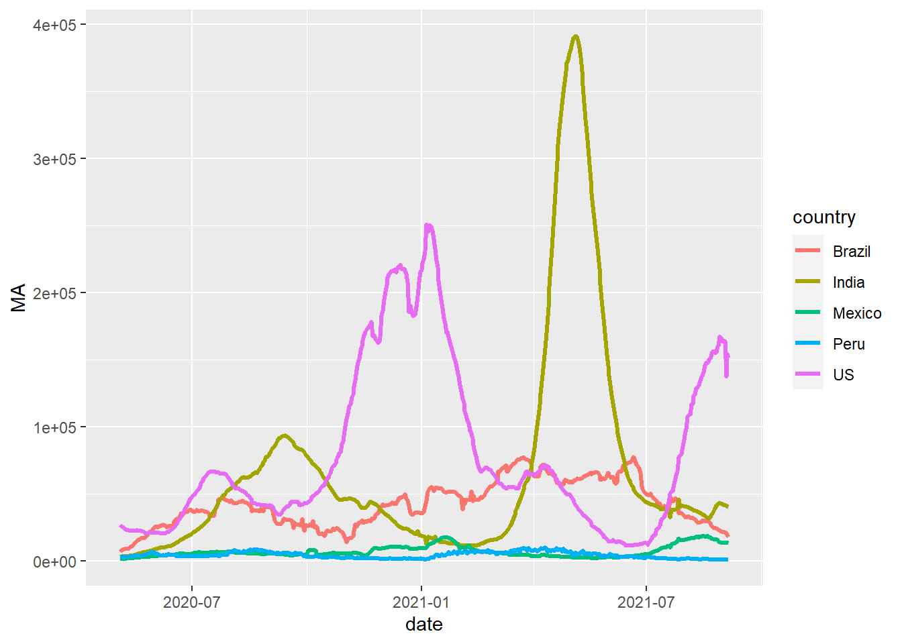
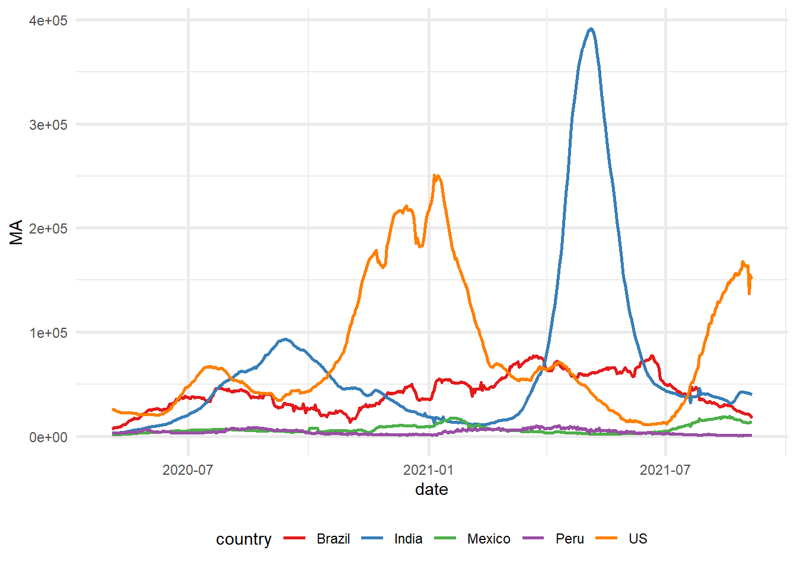

```{r setup, include=FALSE}
knitr::opts_chunk$set(collapse = TRUE)
```

While `R` has variety of options to choose from when it comes to 2D graphics and data visualisation, it is hard to beat `ggplot2` in terms of features, functionality and overall visual quality. While there are many tutorials on how to use `ggplot2`, I wanted to share my take on how to use the package which is, to make customised charting functions for specific chart types using `ggplot2` as the underlying visualisation engine. 

## Libraries
```{r eval = F}
# Pacman is a package management tool 
install.packages("pacman")
```

```{r message = FALSE}
library(pacman)

# p_load automatically installs packages if needed
p_load(dplyr, ggplot2, scales, stringr)
```

## Sample dataset
A clean sample of the entire COVID database hosted by JHU is available for download  [here](https://github.com/royr2/blog/blob/main/download/covid_data.csv)

```{r echo = F}
df <- read.csv("/Github/yetanothercovidapp/plot_data.csv")
```

```{r eval = F}
df <- read.csv("covid_data.csv")
```

Something of interest could be the daily number of confirmed cases for the top five countries (by volume). Some amount of data prep is needed to get to these numbers.

```{r message = F}
# Get top 5 countries
top_countries <- df %>% 
  group_by(country) %>% 
  summarise(count = sum(deaths_daily)) %>% 
  top_n(5) %>% 
  .$country
```

```{r}
print(top_countries)
```

```{r message = F}
# Create a data frame with the required information
# Note that a centered 7 day moving average is used
plotdf <- df %>% 
  mutate(date = as.Date(date)) %>% 
  filter(country %in% top_countries, 
         date >= "2020-05-01") %>% 
  group_by(country, date) %>% 
  summarise(count = sum(confirmed_daily)) %>%
  arrange(country, date) %>% 
  group_by(country) %>% 
  mutate(MA = zoo::rollapply(count, FUN = mean, width = 7, by = 1, fill = NA, align = "center"))

```

## Simple example

Say we needed a line chart visualising the data we just prepared. Note the use `aes_string()` instead of just `aes()`. This lets us supply arguments to `ggplot2` as strings.

```{r message = F}
# Function definition.
line_chart <- function(df, x, y, group_color = NULL, line_width = 1, line_type = 1){
  ggplot(df, aes_string(x = x, y = y, color = group_color)) + 
    geom_line(size = line_width, linetype = line_type)
}
```

```{r chart1, fig.show = 'hide', warning = F, fig.path = ''}
# Test run
line_chart(plotdf, x = "date", y = "MA", group_color = "country", 
           line_type = 1, line_width = 1.2)
```


## Customised theme

Now that we know how to encapsulate the call to `ggplot2` in a more intuitive manner, we can create a customised theme for our charts. This is useful since this theme can be applied to any chart. 

```{r}
custom_theme <- function(plt, base_size = 11, base_line_size = 1, palette = "Set1"){
  
  # Note the use of "+" and not "%>%"
  plt + 
    # Adjust overall font size
    theme_minimal(base_size = base_size, base_line_size = base_line_size) + 
    
    # Put legend at the bottom
    theme(legend.position = "bottom") + 
    
    # Different colour scale
    scale_color_brewer(palette = palette)
}
```

```{r chart2, fig.show = 'hide', warning = F, fig.path = ''}
# Test run
line_chart(plotdf, "date", "MA", "country") %>% custom_theme()
```


## Adding bells and whistles

Now that we have some of the basic components, we can add some additional features to our `line_chart()` function.

```{r}
line_chart <- function(df, x, y, group_color = NULL, 
                       line_width = 1, line_type = 1, 
                       xlab = NULL, ylab = NULL, 
                       title = NULL, subtitle = NULL, caption = NULL){
  # Base plot
  ggplot(df, aes_string(x = x, y = y, color = group_color)) + 
    
    # Line chart 
    geom_line(size = line_width, linetype = line_type) + 
    
    # Titles and subtitles
    labs(x = xlab, y = ylab, title = title, subtitle = subtitle, caption = caption)
}
```

We'll also tinker with our `custom_theme()` function.

```{r}
custom_theme <- function(plt, 
                         palette = "Set1", 
                         format_x_axis_as = NULL, format_y_axis_as = NULL, 
                         x_axis_scale = 1, y_axis_scale = 1, 
                         x_axis_text_size = 10, y_axis_text_size = 10, 
                         base_size = 11, base_line_size = 1){
  
  mappings <- names(unlist(plt$mapping))
  
  p <- plt + 
    
    # Adjust overall font size
    theme_minimal(base_size = base_size, base_line_size = base_line_size) + 
    
    # Put legend at the bottom
    theme(legend.position = "bottom") + 
    
    # Different colour palette
    {if("colour" %in% mappings) scale_color_brewer(palette = palette)}+
    
    {if("fill" %in% mappings) scale_fill_brewer(palette = palette)}+
    
    # Change some theme options
    theme(plot.background = element_rect(fill = "#f7f7f7"), 
          plot.subtitle = element_text(face = "italic"), 
          axis.title.x = element_text(face = "bold", 
                                      size = x_axis_text_size), 
          axis.title.y = element_text(face = "bold", 
                                      size = y_axis_text_size)) + 
    
    # Change x-axis formatting
    {if(!is.null(format_x_axis_as))
      switch(format_x_axis_as, 
             "date" = scale_x_date(breaks = pretty_breaks(n = 12)), 
             "number" = scale_x_continuous(labels = number_format(accuracy = 0.1, 
                                                                  decimal.mark = ",", 
                                                                  scale = x_axis_scale)), 
             "percent" = scale_x_continuous(labels = percent))} + 
    
    # Change y-axis formatting
    {if(!is.null(format_y_axis_as))
      
      switch(format_y_axis_as, 
             "date" = scale_y_date(breaks = pretty_breaks(n = 12)), 
             "number" = scale_y_continuous(labels = number_format(accuracy = 0.1, 
                                                                  decimal.mark = ",", 
                                                                  scale = y_axis_scale)), 
             "percent" = scale_y_continuous(labels = percent))}
  
  # Capitalise all names
  vec <- lapply(p$labels, str_to_title)
  names(vec) <- names(p$labels)
  p$labels <- vec
  
  return(p)
}
```

Now let's see how it all comes together.

```{r chart3, fig.show = 'hide', warning = F, fig.path = ''}
line_chart(plotdf,
           x = "date", 
           y = "MA", 
           group_color = "country", 
           xlab = "Date", 
           ylab = "Moving Avg. (in '000)", 
           title = "Daily COVID19 Case Load", 
           subtitle = "Top 5 countries by volume")%>% 
  
  custom_theme(format_x_axis_as = "date", 
               format_y_axis_as = "number", 
               y_axis_scale = 0.001)
```


## Bar chart example
The good thing about the `custom_theme()` function is that it can be applied to any `ggplot2` object. 

```{r chart4, fig.show = 'hide', warning = F, fig.path = ''}
p <- plotdf %>%  
  mutate(month = format(date, "%m-%b")) %>% 
  ggplot(aes(x = month, y = MA, fill = country)) + 
  geom_col(position = "dodge") + 
  labs(title = "Monthly COVID19 Case load trend", 
       subtitle = "Top 5 countries", 
       x = "Month", 
       y = "Moving Average ('000)")

custom_theme(p, palette = "Set1", format_y_axis_as = "number", y_axis_scale = 0.001)
```


## Parting notes
It is worth noting that building customised charting functions using `ggplot2` is most useful when you need to create the same type of chart(s) again and again. When doing any kind of exploratory work, using `ggplot2` directly is easier and more useful since you can build all kinds of charts (or layer charts of different types) within the same pipeline. 

*Thoughts? Comments? Helpful? Not helpful? Like to see anything else added in here? Let me know!*
