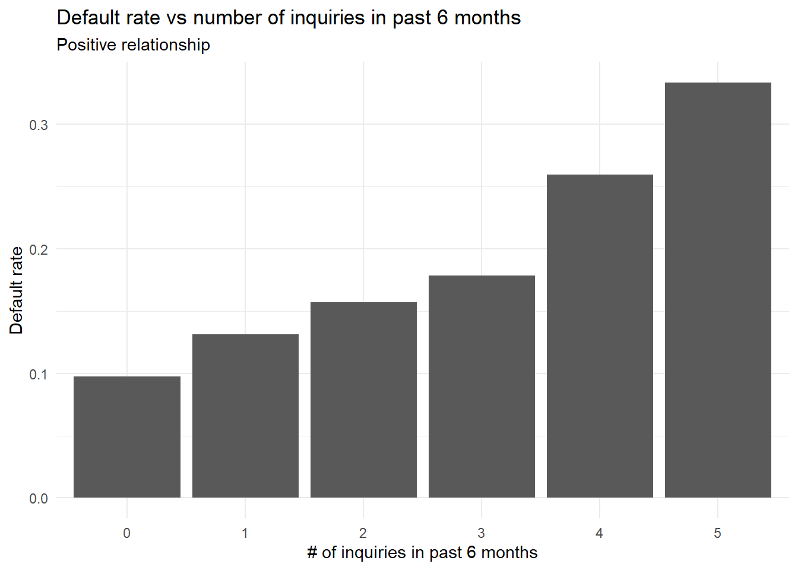

```{r setup, include=FALSE}
knitr::opts_chunk$set(collapse = TRUE)
```

When developing credit risk scorecards, it is generally a good idea to discretise (bin) numeric variables in a manner that ensures monotonically increasing or decreasing event rates as the variable increases or decreases. While discretising individual variables adds stability to the model, monotonic bins ensure that the model output is consistent and interpretable (i.e. if variable 'x' increases, the computed score increases across each bin). We'll explore how to do create monotonic bins in `R` using `xgboost`. 

## Libraries

```{r eval = F}
# Pacman is a package management tool 
install.packages("pacman")
```

```{r message = F, warning = F}
library(pacman)

# p_load automatically installs packages if needed
p_load(recipes, dplyr, ggplot2, xgboost, gridExtra)
```

## Sample dataset

[Here's](https://github.com/royr2/blog/blob/main/download/credit_sample.csv) a small sample sample of the **Lending Club** dataset available on [Kaggle](https://www.kaggle.com/wordsforthewise/lending-club).

```{r echo = F}
sample <- read.csv("../../../download/credit_sample.csv")
```

```{r eval = F}
sample <- read.csv("credit_sample.csv")
```
```{r}
dim(sample)
class(sample)
```
## Create a target

Like in my previous [post](/post/gains_table), I'll use the `loan_status` column as the target variable. 
```{r}
# Specific values to be tagged as 'bad'
codes <- c("Charged Off", "Does not meet the credit policy. Status:Charged Off")

model_data <- sample %>%
  mutate(bad_flag = ifelse(loan_status %in% codes, 1, 0))
```

## Data prep

We'll use the `recipes` package to remove non numeric variables and impute missing values using. For additional details, see the [documentation](https://recipes.tidymodels.org/) for `recipes`. Note that the formula inside the `recipe()` function decides which columns are predictors and which column is the target.

```{r}
# Specify basic recipe
rec <- recipe(bad_flag ~ ., data = model_data) %>%
  step_select(where(is.numeric)) %>% 
  step_impute_median(all_predictors())

rec <- prep(rec, training = model_data)

# Not doing a test/train split 
train <- bake(rec, new_data = model_data)
```

## Analysing directional trend

Now that we have a clean training dataset, its important to ascertain how the event rate *should* change when a particular variable changes. This is important since this directional trend will dictate how we constraint the `xgboost` model. 

A good way to do this is to use both data and intuition. As an example, consider the variable `inq_last_6mths` (number of inquiries in the last 6 months). Intuitively, as the number of inquiries increase, one would expect the event rate (chance of default) to increase. We can validate this using a simple bar chart like the one shown below. 

```{r chart1, fig.show = 'hide', fig.path = ""}
data.frame(x = model_data$inq_last_6mths,
           y = model_data$bad_flag) %>%
  filter(x <= 5) %>% 
  group_by(x) %>% 
  summarise(count = n(), 
            events = sum(y)) %>% 
  mutate(pct = events/count) %>% 
  ggplot(aes(x = factor(x), y = pct)) + 
  geom_col() + 
  theme_minimal() + 
  labs(x = "# of inquiries in past 6 months", 
       y = "Default rate", 
       title = "Default rate vs number of inquiries in past 6 months", 
       subtitle = "Positive relationship")

```



This confirms our hypothesis and also tells us that we need to constraint the `xgboost` model such the probability outcome increases as the value of the variable `inq_last_6mths` increases. 

## xgboost model

We'll create an xgb model with the following specs: 

- One boosting iteration
- `monotone_constraints` = 1 (i.e. splits which only increase the probability outcome)
- `max_depth` = 10 (as an example, can be deeper if one needs additional bins)

```{r}
mdl <- xgboost(
  data = train %>%
    select(inq_last_6mths) %>%  ## Select only inq_last_6mths
    as.matrix(),  ## convert to matrix since the xgboost() interface only accepts matrices
  label = train[["bad_flag"]],  ## Target variable
  nrounds = 1,  ## Only one boosting iteration
  params = list(objective = "binary:logistic", ## Binary outcome
                monotone_constraints = 1, 
                max_depth = 10))  ## 1
```
## Retrieving splits

Now that we have a model, we need to retrieve the split points and evaluate whether the binning scheme is intuitive (or not). 

```{r}
# Convert model into a dataframe like output
splits <- xgb.model.dt.tree(model = mdl)  

# Add +/- Inf to provide coverage for values not observed 
# in the training dataset
cuts <- c(-Inf, sort(splits$Split), Inf)
```

```{r chart2, fig.show = 'hide', fig.path = ""}
# Plot bins and event rates
data.frame(target = train$bad_flag,
           buckets = cut(train$inq_last_6mths, 
                         breaks = cuts, 
                         include.lowest = T, 
                         right = T, 
                         ordered_result = T)) %>% 
  group_by(buckets) %>%
  summarise(total = n(),
            events = sum(target == 1)) %>%
  mutate(pct = events/total) %>%
  ggplot(aes(x = buckets, y = pct)) + 
  geom_col() + 
  theme_minimal() + 
  labs(x = "Bins", 
       y = "Default rate", 
       title = "Monotonic binning for number of inquiries in past 6 months", 
       subtitle = "Monotonically increasing event rate")
```


## Creating a function 

Finally, we can encapsulate everything we have done so far inside a function for better usability.

```{r}
create_bins <- function(var, outcome, max_depth = 10, plot = T){
  
  # Check if relationship is positive or negative 
  # Using spearman since it measures strength of monotonic relationship 
  corr <- cor(var, outcome, method = "spearman")
  direction <- ifelse(corr > 0, 1, -1)
  
  # Build XGB model 
  mdl <- xgboost(
    verbose = 0,
    data = as.matrix(var),
    label = outcome,
    nrounds = 1,  
    params = list(objective = "binary:logistic", ## Binary outcome
                  monotone_constraints = direction, 
                  max_depth = max_depth, 
                  eval_metric = "auc"))
  
  # Retrieve splits 
  splits <- xgb.model.dt.tree(model = mdl)
  cuts <- c(-Inf, sort(splits$Split), Inf)
  binned <- cut(var, 
                breaks = cuts, 
                include.lowest = T, 
                right = T, 
                ordered_result = T)
  
  # Create an event rate plot
  plt <- data.frame(outcome, binned) %>% 
      group_by(binned) %>%
      summarise(total = n(),
                events = sum(outcome == 1)) %>%
      mutate(pct = events/total) %>%
      ggplot(aes(x = binned, y = pct)) + 
      geom_col() + 
      theme_minimal() + 
      labs(x = "Bins", 
           y = "Event Rate", 
           title = "Monotonic binning output")
    
  if(plot == T){
    print(plt)
  }
  
  # List to be returned
  lst <- list(
    var = var, 
    binned_var = binned, 
    cor = corr, 
    plot = plt
  )
  
  return(lst)
}
```

```{r}
# Test function
v1 <- create_bins(train$fico_range_high, train$bad_flag, max_depth = 10, plot = F)
v2 <- create_bins(train$delinq_amnt, train$bad_flag, max_depth = 10, plot = F)
v3 <- create_bins(train$int_rate, train$bad_flag, max_depth = 10, plot = F)
v4 <- create_bins(train$annual_inc, train$bad_flag, max_depth = 10, plot = F)
```

```{r chart3, fig.show = 'hide', fig.path = ""}
grid.arrange(v1$plot + labs(subtitle = "Fico Range High"), 
             v2$plot + labs(subtitle = "Delinq Amount"), 
             v3$plot + labs(subtitle = "Interest Rate"), 
             v4$plot + labs(subtitle = "Annual Income"), 
             ncol = 2)
```

 

And that's it! We can use what we just built to discretise variables we need, perform `one-hot-encoding` or `WOE-transformations` and feed the appropriate model matrix to our choice of statistical routine. 

## Parting notes
Check out this package called [`MonotonicOptimalBinning`](https://github.com/statcompute/mob) by Wensui Liu which offers multiple binning strategies like isotonic binning, quantile binning and k-means binning. 

*Thoughts? Comments? Helpful? Not helpful? Like to see anything else added in here? Let me know!*
