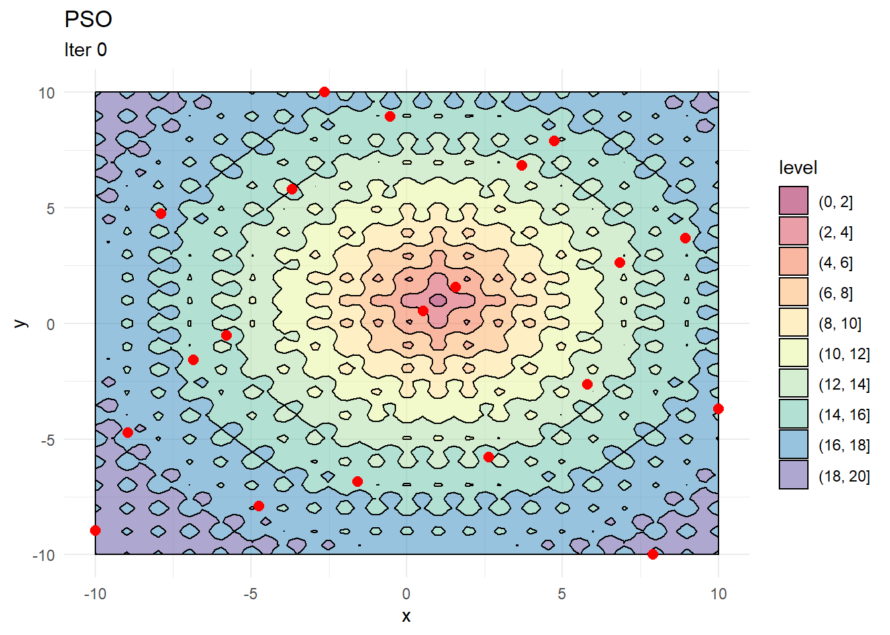
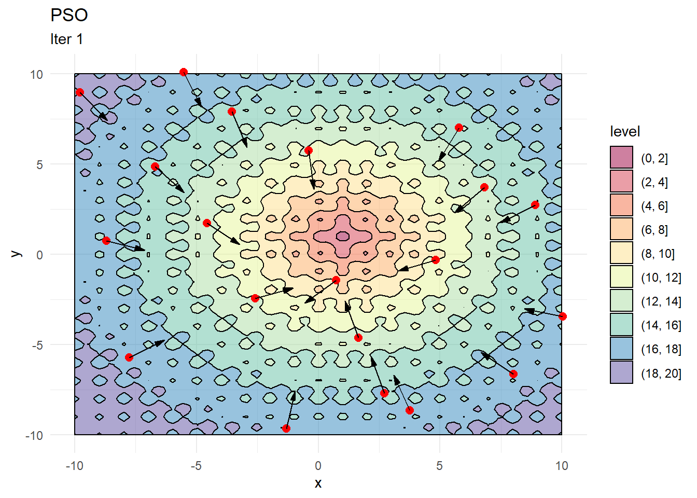
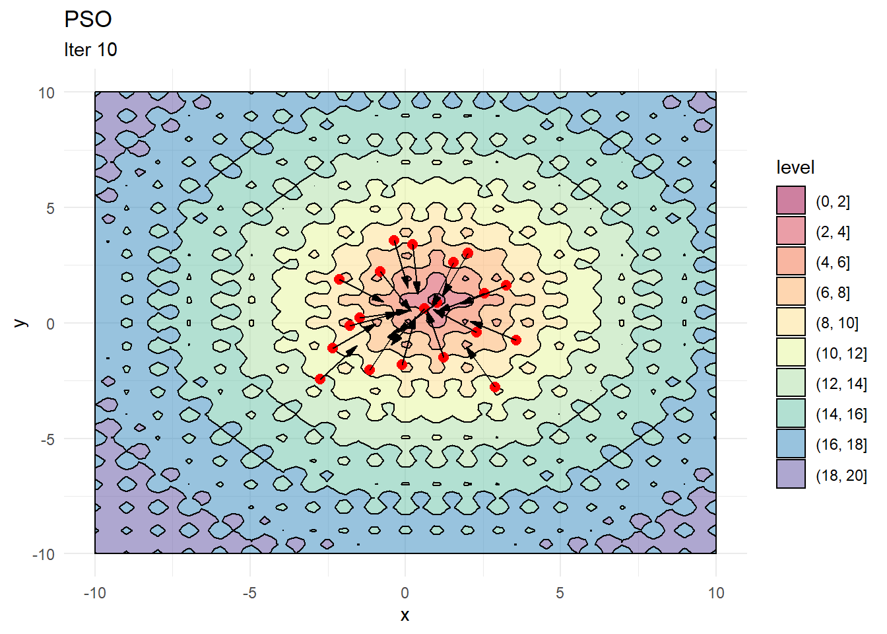
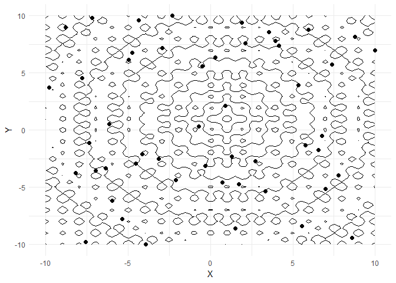
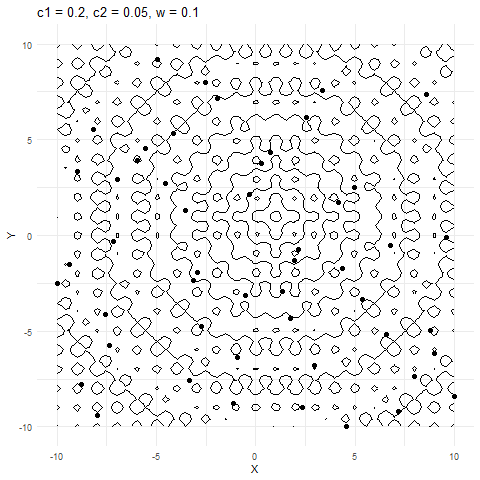
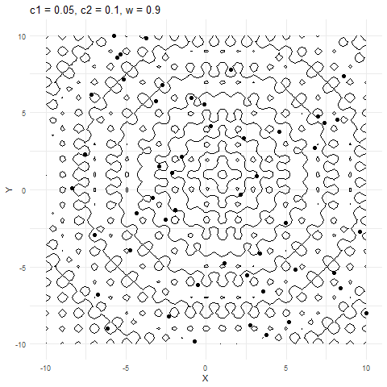

<script src="https://polyfill.io/v3/polyfill.min.js?features=es6"></script>
<script id="MathJax-script" async src="https://cdn.jsdelivr.net/npm/mathjax@3/es5/tex-mml-chtml.js"></script>

```{r setup, include=FALSE}
knitr::opts_chunk$set(collapse = TRUE)
```

This post is inspired by a really approachable [post](https://machinelearningmastery.com/a-gentle-introduction-to-particle-swarm-optimization/?utm_source=drip&utm_medium=email&utm_campaign=An+intro+to+particle+swarm+optimization&utm_content=An+intro+to+particle+swarm+optimization) on particle swarm optimisation by [Adrian Tam](https://machinelearningmastery.com/author/adriantam/). We'll build a basic particle swam optimiser in R and try to visualise the results.

## Libraries
```{r}
# install.packages(pacman)
pacman::p_load(dplyr, gganimate, metR)
```

## Objective function

We'll use the [Ackley's Function](https://en.wikipedia.org/wiki/Ackley_function) here to evaluate how well the optimiser works. The function has many local optima and should pose a challenge to the optimisation routine. 

```{r}
obj_func <- function(x, y){
  # Modifying for a different global minimum
  -20 * exp(-0.2 * sqrt(0.5 *((x-1)^2 + (y-1)^2))) - exp(0.5*(cos(2*pi*x) + cos(2*pi*y))) + exp(1) + 20
}
```

```{r}
# Set of x and y values (search domain)
x <- seq(-10, 10, length.out = 100)
y <- seq(-10, 10, length.out = 100)

# Create a data frame that stores every permutation of 
# x and y coordinates
grid <- expand.grid(x, y, stringsAsFactors = F)
```

```{r}
head(grid)
```

```{r chart1, fig.path="", fig.show='hide'}
# Evaluate the objective function at each x, y value
grid$z <- obj_func(grid[,1], grid[,2])

# create a contour plot
contour_plot <- ggplot(grid, aes(x = Var1, y = Var2)) +
  geom_contour_filled(aes(z = z), color = "black", alpha = 0.5) +
  scale_fill_brewer(palette = "Spectral") + 
  theme_minimal() + 
  labs(x = "x", y = "y", title = "Ackley's Function", subtitle = "Contour plot")

contour_plot
```


## Optimiser basics

The optimiser works as such:
- Start with set of random search points uniformly distributed across the search domain 
- Find the objective function value at each of these points 
- Track the minimum(or maximum) value of the objective function achieved at each search point
- Move each search point a small amount in two directions:
  - Towards the locally optimal value (for that point)  
  - Towards the globally optimal value (across all points)  
- Repeat 

Or to put it more formally: 

Say we are operating in 2 dimensions (x and y coordinates). Then, for each particle `i`

$$x_{t+1}^i = x_{t}^i + \Delta{x_t}^i$$
$$y_{t+1}^i = y_{t}^i + \Delta{y_t}^i$$

And, 

$$\Delta{x_t}^i = w\Delta{x_{t-1}^i} + c_1r_1(x_{localBest} - x_i) + c_2r_2(x_{globalBest} - x_i)$$
$$\Delta{y_t}^i = w\Delta{y_{t-1}^i} + c_1r_1(y_{localBest} - y_i) + c_2r_2(y_{globalBest} - y_i)$$

Where `w`, `c1`, `c2`, `r1`, `r2` are positive constants. `r1` and `r2` are uniformly distributed (positive) random numbers. These random numbers need to be positive because the direction in which each particle will move is decided by where `localBest` and `globalBest` are. Again, `localBest` is the optimal function value observed by the `ith` particle and `globalBest` is the optimal function value across all particles.

## Implementing a single iteration

### Initial positions

```{r}
# Say we start with 20 particles
n_particles <- 20

# Set some initial values for constants
w <- 0.5
c1 <- 0.05
c2 <- 0.1

# Search domain in x and y coordinates 
x <- seq(-10, 10, length.out = 20)
y <- seq(-10, 10, length.out = 20)

# Combine into a matrix
X <- data.frame(x = sample(x, n_particles, replace = F), 
                y = sample(y, n_particles, replace = F))
```

```{r chart2, fig.path="", fig.show='hide'}
# Chart starting locations
contour_plot + 
  geom_point(data = X, aes(x, y), color = "red", size = 2.5) + 
  labs(title = "PSO", subtitle = "Iter 0")
```



### Starting perturbations 

```{r}
# Uniformly distributed (positive) perturbations
dX <- matrix(runif(n_particles * 2), ncol = 2)

# Scale down the perturbations by a factor (w in the equation above)
dX <- dX * w
```

```{r}
# Set the location of the local best (optimal value) to starting positions 
pbest <- X

# Evaluate the function at each point and store 
pbest_obj <- obj_func(X[,1], X[,2])

# Find a global best and its position
gbest <- pbest[which.min(pbest_obj),]
gbest_obj <- min(pbest_obj)
```

```{r chart3, fig.path="", fig.show='hide'}
X_dir <- X %>% 
  mutate(g_x = gbest[1,1], 
         g_y = gbest[1,2], 
         angle = atan((g_y - y)/(g_x - x))*180/pi, 
         angle = ifelse(g_x < x, 180 + angle, angle))

contour_plot + 
  geom_point(data = X, aes(x, y), color = "red", size = 2.5) + 
  geom_arrow(data = X_dir, aes(x, y, mag = 1, angle = angle), direction = "ccw", pivot = 0, show.legend = F) + 
  labs(title = "PSO", subtitle = "Iter 0")
```


### Updating Positions 

```{r}
# Update dx based on the equation shown previously
dX <- w * dX + c1*runif(1)*(pbest - X) + c2*runif(1)*(as.matrix(gbest) - X)

# Add dx to current locations
X <- X + dX

# Evaluate objective function at new positions
# Note that X[,1] is the first column i.e. x coordinates
obj <- obj_func(X[,1], X[,2])

# Find those points where the objective function is lower 
# than previous iteration 
idx <- which(obj >= pbest_obj)

# Update locations of local best and store local best values
pbest[idx,] <- X[idx,]
pbest_obj[idx] <- obj[idx]

# Identify the minimum value of the of the objective function 
# amongst all points 
idx <- which.min(pbest_obj)

# Store as global best 
gbest <- pbest[idx,]
gbest_obj <- min(pbest_obj)
```

```{r chart4, fig.path="", fig.show='hide'}
X_dir <- X %>% 
  mutate(g_x = gbest[1,1], 
         g_y = gbest[1,2], 
         angle = atan((g_y - y)/(g_x - x))*180/pi, # Need angles to show direction
         angle = ifelse(g_x < x, 180 + angle, angle))

contour_plot + 
  geom_point(data = X, aes(x, y), color = "red", size = 2.5) + 
  geom_arrow(data = X_dir, aes(x, y, mag = 1, angle = angle), direction = "ccw", pivot = 0, show.legend = F) + 
  labs(title = "PSO", subtitle = "Iter 1")
```


```{r chart6, fig.path="", fig.show='hide', echo = F}
# Update dx based on the equation shown previously

for(i in 1:8){
  dX <- w * dX + c1*runif(1)*(pbest - X) + c2*runif(1)*(as.matrix(gbest) - X)
  
  # Add dx to current locations
  X <- X + dX
  
  # Evaluate objective function at new positions
  # Note that X[,1] is the first column i.e. x coordinates
  obj <- obj_func(X[,1], X[,2])
  
  # Find those points where the objective function is lower 
  # than previous iteration 
  idx <- which(obj >= pbest_obj)
  
  # Update locations of local best and store local best values
  pbest[idx,] <- X[idx,]
  pbest_obj[idx] <- obj[idx]
  
  # Identify the minimum value of the of the objective function 
  # amongst all points 
  idx <- which.min(pbest_obj)
  
  # Store as global best 
  gbest <- pbest[idx,]
  gbest_obj <- min(pbest_obj)
}

X_dir <- X %>% 
  mutate(g_x = gbest[1,1], 
         g_y = gbest[1,2], 
         angle = atan((g_y - y)/(g_x - x))*180/pi, 
         angle = ifelse(g_x < x, 180 + angle, angle))

contour_plot + 
  geom_point(data = X, aes(x, y), color = "red", size = 2.5) + 
  geom_arrow(data = X_dir, aes(x, y, mag = 1, angle = angle), direction = "ccw", pivot = 0, show.legend = F) + 
  labs(title = "PSO", subtitle = "Iter 10")
```


## Putting it all together

We can now encapsulate everything inside a function for ease of use. 

```{r}
# Final function
pso_optim <- function(obj_func,  #Accept a function directly 
                      c1 = 0.05,
                      c2 = 0.05,
                      w = 0.8,
                      n_particles = 20,
                      init_fact = 0.1,
                      n_iter = 50, 
                      ...   # This ensures we can pass any additional 
                            # parameters to the objective function
){
  
  x <- seq(min(x), max(x), length.out = 100)
  y <- seq(min(y), max(y), length.out = 100)
  
  X <- cbind(sample(x, n_particles, replace = F),
             sample(y, n_particles, replace = F))
  
  dX <- matrix(runif(n_particles * 2) * init_fact, ncol = 2)
  
  pbest <- X
  pbest_obj <- obj_func(x = X[,1], y = X[,2])
  
  gbest <- pbest[which.min(pbest_obj),]
  gbest_obj <- min(pbest_obj)
  
  loc_df <- data.frame(X, iter = 0)
  iter <- 1
  
  while(iter < n_iter){
    
    dX <- w * dX + c1*runif(1)*(pbest - X) + c2*runif(1)*t(gbest - t(X))
    X <- X + dX
    
    obj <- obj_func(x = X[,1], y = X[,2])
    
    idx <- which(obj <= pbest_obj)
    pbest[idx,] <- X[idx,]
    pbest_obj[idx] <- obj[idx]
    
    idx <- which.min(pbest_obj)
    gbest <- pbest[idx,]
    gbest_obj <- min(pbest_obj)
    
    # Update iteration
    iter <- iter + 1
    loc_df <- rbind(loc_df, data.frame(X, iter = iter))
  }
  
  lst <- list(X = loc_df, obj = gbest_obj, obj_loc = paste0(gbest, collapse = ","))
  return(lst)
}
```

```{r}
# Test optimiser
out <- pso_optim(obj_func,
                 x = x,
                 y = y,
                 c1 = 0.01,
                 c2 = 0.05,
                 w = 0.5, 
                 n_particles = 50,
                 init_fact = 0.1,
                 n_iter = 200)
```

```{r}
# Global minimum is at (1,1)
out$obj_loc
```

## Animating results
This part is fun! We can use the awesome `gganimate` package to visualise the path of each point and see how the optimiser searches and converges towards an optimal value.  

```{r eval = F}
ggplot(out$X) +
  geom_contour(data = grid, aes(x = Var1, y = Var2, z = z), color = "black") +
  geom_point(aes(X1, X2)) +
  labs(x = "X", y = "Y") +
  transition_time(iter) +
  ease_aes("linear")
```

```{r echo = F}
g <- ggplot(out$X) +
  geom_contour(data = grid, aes(x = Var1, y = Var2, z = z), color = "black") +
  geom_point(aes(X1, X2), size = 2) +
  labs(x = "X", y = "Y") +
  theme_minimal() + 
  transition_time(iter) +
  ease_aes("linear")
```

```{r echo = F} 
anim_save(filename = "anim.gif", animation = g)
```



## Parting notes

A few things are worth noting here: 

1. `c1` decides how much a given point moves towards the best value that it has encountered thus far. Keeping this value low helps the optimiser converge faster. 
2. Increasing `w` also helps converge faster but if its too high and then the optimiser tends to swing back and forth between solutions.



```{r echo = F}
out <- pso_optim(obj_func,
                 x = x,
                 y = y,
                 c1 = 0.2,
                 c2 = 0.05,
                 w = 0.1, 
                 n_particles = 50,
                 init_fact = 0.1,
                 n_iter = 100)

g <- ggplot(out$X) +
  geom_contour(data = grid, aes(x = Var1, y = Var2, z = z), color = "black") +
  geom_point(aes(X1, X2), size = 2) +
  labs(x = "X", y = "Y", title = "c1 = 0.2, c2 = 0.05, w = 0.1") +
  theme_minimal() + 
  transition_time(iter) +
  ease_aes("linear")

anim_save(filename = "anim_1.gif", animation = g)
```
 



```{r echo = F}
out <- pso_optim(obj_func,
                 x = x,
                 y = y,
                 c1 = 0.05,
                 c2 = 0.1,
                 w = 0.9, 
                 n_particles = 50,
                 init_fact = 0.1,
                 n_iter = 100)

g <- ggplot(out$X) +
  geom_contour(data = grid, aes(x = Var1, y = Var2, z = z), color = "black") +
  geom_point(aes(X1, X2), size = 2) +
  labs(x = "X", y = "Y", title = "c1 = 0.05, c2 = 0.1, w = 0.9") +
  theme_minimal() + 
  transition_time(iter) +
  ease_aes("linear")

anim_save(filename = "anim_2.gif", animation = g)
```


*Thoughts? Comments? Helpful? Not helpful? Like to see anything else added in here? Let me know!*
